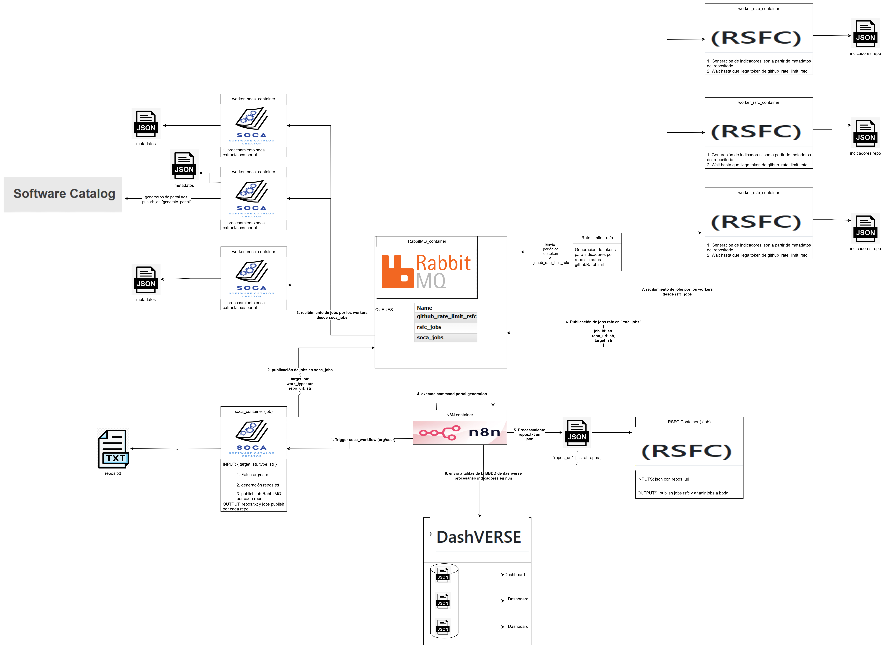

[](https://doi.org/10.5281/zenodo.18879858)

[](https://www.repostatus.org/#active)
[](https://www.apache.org/licenses/LICENSE-2.0)
[](https://github.com/SergioZSZ/Software-Quality-Observatory-Orchestrator-TFG/releases)

**🚧🚧 STILL IN PROGRESS 🚧🚧**

Documentación detallada en : https://software-quality-observatory-orchestrator.readthedocs.io/es/latest/

# TFG – Orquestación automatizada de evaluación de software y generación de catálogo


## 1. Objetivo del proyecto

El objetivo del TFG es diseñar e implementar un sistema reproducible que:

1. Extraiga automáticamente repositorios de GitHub
2. Genere metadatos estructurados del software
3. Evalúe la calidad del software mediante indicadores automáticos
4. Prepare la información para su integración en dashboards (DashVERSE) y catálogos (SOCA)
5. Permita orquestar todo el proceso mediante workflows automatizados

El sistema se basa en la integración y orquestación de herramientas existentes dentro de una arquitectura desacoplada y reproducible.


## 2. Arquitectura del sistema
---
| Componente       | Rol                                    |
| ---------------- | -------------------------------------- |
| n8n              | Orquestación                           |
| soca_container   | extracción metadatos y repos           |
| rsfc_container   | creación de jobs                       |
| rabbitmq         | message broker                         |
| worker_rsfc      | procesamiento jobs indicadores         |
| worker_soca      | procesamiento jobs metadatos           |
| rate_limiter_rsfc| limitador tokens githubAPI worker_rsfc |
| rate_limiter_soca| limitador tokens githubAPI worker_soca |
| DashVerse        | observatorio de evaluación             |


---




---

Cada herramienta se ejecuta en su propio entorno aislado, garantizando:

- Reproducibilidad
- Portabilidad
- Independencia del sistema operativo
- Aislamiento de dependencias
- Escalabilidad


## 3. Estado actual del desarrollo
### 3.1 Dockerización de SOCA

Se ha:

- Preparado entorno aislado con poetry
- Clonado y preparado SOCA
- Adaptado su ejecución vía execute-command de n8n
- Encapsulado en un contenedor Docker
- Configurado volúmenes para persistencia de resultados
- Orquestado mediante lanzamiento de jobs para la extracción de metadatos por workers en paralelo
- Configurado un script para la generación del portal ejecutado por n8n
Salida generada:

- Fetch de los repositorios y envío a n8n
- Repositorios descargados
- Metadatos estructurados
- Portal web del catálogo


### 3.2 worker_soca container
El contenedor worker se encarga de la extracción de metadatos de los repositorios obtenidos en el fetch y generación del portal de manera asíncrona con el resto del workflow.

Mientras que soca_container publica en una cola de trabajo en RabbitMQ con el usuario/organización del cual se va a general el portal software.

Cada worker ejecuta el módulo `python -u -m soca_runner.worker` que se dedica a:

1. Recibe un job de RabbitMQ (con el target)
2. Se extraen metadatos de los repos obtenidos en el fetch por workers paralelos o genera un fichero explicando el error en caso de que no se pudiese extraer

El sistema permite escalar horizontalmente el número de workers mediante docker compose lanzándolo con``docker compose up --scale worker_soca=N`` siendo N el número de workers que se levantarán.

### 3.3 Dockerización de RSFC

Se ha:

- Preparado entorno aislado con poetry
- Instalado RSFC en el entorno
- Adaptado su ejecución vía execute-command de n8n
- Encapsulado en contenedor independiente
- Orquestado mediante lanzamiento de jobs a RabbitMQ la extraccion de indicadores
- Implementado lanzamiento de workers para procesar los jobs usando la cola de trabajo de RabbitMQ

Salida generada:
- Generación de indicadores de calidad de cada repositorio en formato `json`

### 3.4 worker_rsfc container
El contenedor worker se encarga del procesamiento asíncrono de los jobs generados por rsfc_container.

Mientras que rsfc_container actúa como encargado de registrar los jobs en la cola de trabajo de RabbitMQ correspondiente, los workers se encargan de consumir dichos jobs y ejecutar el análisis con RSFC.

Cada worker ejecuta el módulo `python -u -m rsfc_runner.worker` que se encarga de recibir los jobs publicados en RabbitMQ que:

1. Recibe un job de RabbitMQ
2. Ejecuta la evaluación del repositorio mediante rsfc
3. Genera un `rsfc_assessment.json` con los indicadores de calidad  o `failed_assessment.json` explicando el error de procesamiento
4. Espera a tener token para procesar siguiente trabajo (github rate limit)
5. Responde a RabbitMQ habiendo procesado el job para recibir otro

El sistema permite escalar horizontalmente el número de workers mediante docker compose lanzándolo con``docker compose up --scale worker_rsfc=N`` siendo N el número de workers que se levantarán.


### 3.5 rate_limiter_rsfc container
El contenedor rate_limiter se encarga del envío de tokens a una cola de RabbitMQ de tamaño 1. Los workers RSFC se esperarán a obtener un token de la cola para procesar los jobs para no saturar de peticiones GitHubAPI y no sobrepasar el RateLimit.


### 3.6 DashVerse Service
El servicio DashVerse sirve para la creación y visualización de los dashboards creados a partir de los indicadores de calidad obtenidos de las organizaciones. Dentro del directorio `/DashVERSE_dashboard` existe una plantilla con diversos dashboards, los cuales son:
1. KPIs generales:
   - Total de assessments procesados
   - Porcentaje de repositorios que cumplen el umbral de calidad (≥66%)

2. Análisis de resultados:
   - Distribución de procesos Passed vs Failed
   - Distribución de fallos por tier de indicadores (crucial, recommended, good_to_have, etc.)
   - Histograma de calidad de los assessments

3. Análisis por repositorio:
   - Tabla de metadatos/información de los repositorios
   - Top 10 mejores repositorios según score de calidad
   - Top 10 peores repositorios

4. Análisis de fallos:
   - Tabla de assessments con tests fallidos (incluyendo indicador y repositorio)
   - Top 5 indicadores que más fallan
   - Top 5 procesos que más fallan

Con la plantilla dada en `/DashVERSE_dashboard` hay opciones cross-filtering, útiles por ejemplo para a seleccionar el nombre/id de un repositorio en el dashboard de metadatos, y que aparezcan en el dashboar de procesos de RSFC fallidos únicamente los procesos fallidos por ese repositorio.

Para filtrar por organizaciones es necesario crear un filtro de la siguiente manera:
 *in progress_ filtros de orgs para dashboard, cross-filtering...*


### 3.6 Flujo actual(container n8n)
El sistema utiliza **n8n** como motor de orquestación para coordinar la ejecución completa del pipeline de análisis. 

A diferencia de versiones anteriores, donde el flujo estaba dividido en múltiples workflows (`soca`, `rsfc`, `dashboard`), actualmente se ha **unificado en un único workflow end-to-end**, simplificando la gestión, monitorización y control del proceso.

---

#### Descripción general del flujo

El workflow implementa un pipeline completo que abarca:

1. **Extracción de repositorios**
2. **Procesamiento de metadatos (SOCA)**
3. **Generación de portal/**
4. **Evaluación de calidad (RSFC)**
4. **Envío de indicadores a DashVERSE**

---

####  Etapas del workflow

##### 1. Inicialización 

- Trigger manual (`Execute Workflow`)
- Definición del objetivo (`target`) y tipo (`user` / `org`)
- Ejecución del contenedor: ```soca-heavy:latest ```
- Ejecución del pipeline SOCA por los workers
- Generación de metadatos por repositorio

##### 2. Lectura y procesamiento de repositorios

- Lectura del archivo generado: `repos.txt`
- Transformación a lista de URLs
- Cálculo del número total de repositorios (repo_count)
- Control de finalización procesamiento de repositorios: se espera a que los jsons generados sean iguales a la cantidad de repositorios de `repos.txt`


##### 3. Generación del portal
- Generación del portal software mediante nodo Execute-command lanzando un contenedor docker ejecutando el script `genportal.py`, generándose el portal software.

##### 4. Evaluación RSFC
- Envío de repositorios a los workers RSFC, evaluando la calidad de software
- Control de finalización: se espera a que los jsons generados sean iguales a la cantidad de repositorios de `repos.txt`

##### 5. Envío de assessments a DashVERSE

- Lectura de los archivos generados: `rsfc_assessment.json` por cada repositorio
- Extracción y transformación de los datos del assessment
- Separación en tres entidades:
   - `assessments`: información general del assessment (contexto, tipo, nombre, descripción, fecha de creación del assessment, licencia)
   - `assessment_software`: información del software evaluado (nombre, versión, URL)
   - `assessment_checks`: checks individuales del assessment (indicadores, evidencias, resultados)
- Iteración sobre cada repositorio y sus checks mediante nodos `Split Out`
- Envío de datos mediante peticiones HTTP POST a la API de DashVERSE:
   - `/assessments`
   - `/assessment_software`
   - `/assessment_checks`
- Uso de la cabecera `Prefer: resolution=merge-duplicates` para evitar duplicados en la base de datos
- Persistencia final de los resultados en DashVERSE para su posterior visualización en dashboards


---

## 4. Requisitos(Requirements)
    
   - Docker/Docker Desktop
   - Estar loggeado en Docker/Docker Desktop
   - Minikube (DashVERSE)
   - Helm (DashVERSE)
   - Kubectl (DashVERSE)


Herramientas usadadas en el proyecto:
   - SOCA: https://github.com/oeg-upm/soca/
   - RSFC: https://github.com/oeg-upm/rsfc/
   - SOMEF: https://github.com/KnowledgeCaptureAndDiscovery/somef
   - DASHVERSE: https://github.com/EVERSE-ResearchSoftware/DashVERSE
      

### 4.2 Instalación/Despliegue

**PREVIA:** Se debe crear un archivo `.env` en el directorio `/containers` que tenga las variables entorno: 
   - `GITHUB_TOKEN` siguiendo el formato `GITHUB_TOKEN=xxxxxx` siendo `xxxxxx` el token personal de github obtenido desde github

   - `RABBITMQ_USER` usuario de RabbitMQ del docker compose
   - `RABBITMQ_PASSWORD` contraseña de RabbitMQ del docker compose

   - ``RATE_LIMIT_SOCA_ENABLED`` y `RATE_LIMIT_RSFC_ENABLED` poner true/false dependiendo de si se quiere activar el limiter para los workers para peticiones a GitHubAPI(con workers de soca no hace falta debido a que realiza 1 petición/repo, de rsfc si ya que realiza 7 aprox)

   - `OUTPUTS` la ruta de acceso al directorio a usar como volumen compartido (se debe llamar ``outputs`` y estar dentro del directorio `/containers`)

   - `DASHBOARD_ORG_URL` la URL al dashboard org desplegado, `http://localhost:8088/superset/dashboard/nº_de_dashboard/` en caso de seguir las indicaciones del README y lanzarlo en local

   - `DASHBOARD_REPO_URL` la URL al dashboard repo desplegado, `http://localhost:8088/superset/dashboard/nº_de_dashboard/` en caso de seguir las indicaciones del README y lanzarlo en local

    ejemplo en `/containers/.env.example`. Se pueden usar tal cual las variables del archivo menos `GITHUB_TOKEN` y `OUTPUTS` y `DASHBOARD_URL`. 
    
    El token se debe obtener desde GitHub y generarlo con la opción 'All repositories', si no saltará error el uso de ese token. Se puede dejar vacía pero sólo se podrán realizar 50 peticiones por hora a GitHubAPI (no recomendable, muchos repos = error).

    El nº de dashboard es el que aparezca tras importar en DashVERSE la plantilla contenida en `/DashVERSE_dashboard`


### 4.2.1 Despliegue del orquestador
1. Generar imágenes  docker:
   - `soca-heavy`:
      - Directorio desde el que crearla: `/containers/soca_container` 
      - Mandato: `docker build -t soca-heavy .`
   - `rsfc-heavy`:
      - Directorio desde el que crearla: `/containers/rsfc_container` 
      - Mandato: `docker build -t rsfc-heavy .`

2. Desde el directorio `/containers` ejecutar el mandato en la terminal `docker compose up -d --scale worker_rsfc=N --scale worker_soca=N`, siendo N el nº de workers a lanzar (si es la primera vez desplegándolo usar la etiqueta `--build` )
   - Configuración usada en desarrollo RSFC worker = 4 | SOCA worker = 10

3. Acceder a n8n mediante el navegador en http://localhost:5678
4. En el primer acceso:
    1. Crear cuenta de usuario en n8n
    2. Importar el workflow de `/containers/n8n_container/workflow/` en un nuevo
5. Editar el nodo `Input` al principio del workflow con la organización/usuario deseado
6. Ejecutar manualmente

Tras ello se ejecutará el workflow obteniendo en el directorio outputs declarado las extracciones, portal, metadatos e indicadores correspondientes y enviándoselos a DashVERSE.


### 4.2.2 Despliegue de DashVERSE

🚧🚧 *In_Progress (falta despliegue dashverse)* 🚧🚧


---

## 5. Evaluación del paralelismo en los workers
## 5.1 Hardware usado en las pruebas

| Componente        | Especificación                  |
| ----------------- | ------------------------------- |
| Equipo            | Lenovo 20WNS30L13               |
| CPU               | Intel Core i7-1185G7 (11th Gen) |
| Núcleos           | 4 cores / 8 threads             |
| Frecuencia        | ~3.0 GHz                        |
| RAM               | 16 GB                           |
| Sistema Operativo | Windows 11 Pro 64 bits          |
| DirectX           | DirectX 12                      |

## 5.2 Rendimientos
Se comparó el rendimiento del sistema utilizando la configuración de workers considerada óptima para el hardware disponible durante el desarrollo frente al tiempo total secuencial estimado.

Este tiempo secuencial se calculó como el sumatorio de los tiempos individuales de procesamiento de cada repositorio, tanto en la fase de extracción de metadatos (SOCA) como en la fase de evaluación de calidad (RSFC). De este modo, se obtiene una aproximación del tiempo total que habría requerido la ejecución en un escenario completamente secuencial.

La comparación entre ambos enfoques permite evaluar el grado de paralelización alcanzado por el sistema, así como cuantificar la mejora en términos de reducción del tiempo total de ejecución.

### Organización FAIR2ADAPT
#### datos:
- 27 repositorios
#### Tabla
| Métrica                          | Tiempo   |
|----------------------------------|----------|
| SOCA (10 workers)                | 1m 20s   |
| RSFC (4 workers)                 | 3m 30s   |
|                                  |          |
| SOCA secuencial (total)          | 11m 50s  |
| RSFC secuencial (total)          | 13m 20s  |


### Organización oeg-upm
#### datos:
- 376 repositorios
#### Tabla
| Métrica                          | Tiempo     |
|----------------------------------|------------|
| SOCA (10 workers)                | 36m 57s    |
| RSFC (4 workers)                 | 50m 02s    |
|                                  |            |
| SOCA secuencial (total)          | 5h 47m 22s |
| RSFC secuencial (total)          | 3h 19m 20s |


#### Conclusiones
| Organización | Tiempo paralelo | Tiempo secuencial | Speedup |
|-------------|-----------------|-------------------|---------|
| FAIR2ADAPT  | 4m 50s          | 25m 10s           | 5.21x   |
| OEG-UPM     | 1h 26m 59s      | 9h 06m 42s        | 6.28x   |

Los resultados obtenidos muestran un speedup significativo en ambos escenarios evaluados.

Se observa que:
- El sistema escala mejor en cargas grandes (oeg-upm), donde el paralelismo se aprovecha más eficientemente.
- El speedup no es lineal debido a:
  - Overhead de coordinación entre workers
  - Limitaciones de la GitHub API (rate limiting)
  - Latencias de red y operaciones de I/O

A pesar de ello, se consigue una reducción sustancial del tiempo total de ejecución, validando la arquitectura distribuida propuesta.

---
## 6. Issues

NEXT STEPS:
- Mejoras en SOCA:
    - Mejorar visualización de metadatos:
      - ver si mejorar metadatos requirements
      - si hay documentación readthedocs apuntar a ella

- FAIRificar los repositorios mejorando los checks de metadatos
- (Si da tiempo) automatizar sugerencias para mejorar los repositorios
